# TP1_InjectionDependances
<h1> Part 1 : </h1>
<h3> Question 1,2,3,4 : </h3>
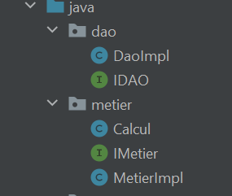
<h2> 5.a : injection des dependances par Instantiation statique </h2>
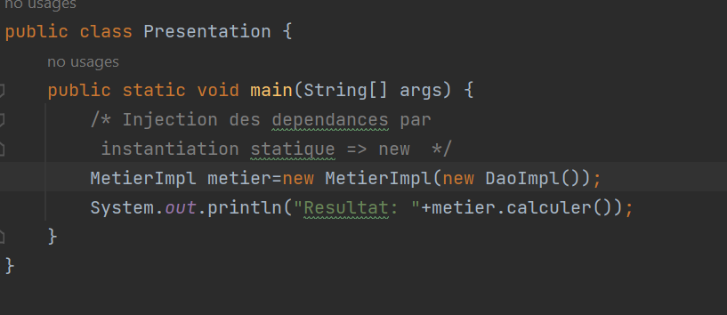
<h2> 5.b : injection des dependances par Intantiation dynamique : </h2>
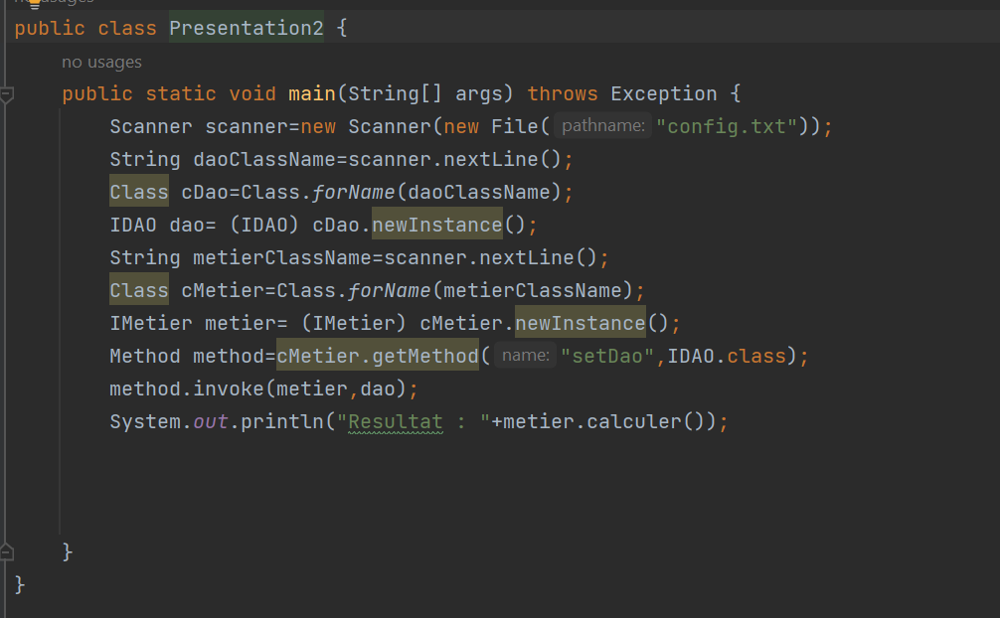
<h2> c.1 : Injection des dependances avec SPRING en utilisant la version annotation : </h2>
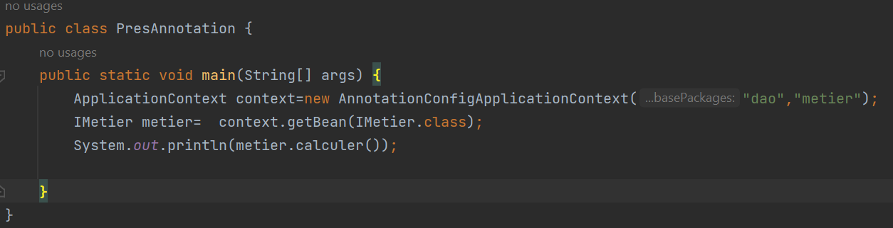
<h2> c.2 : Injection des dependances avec SPRING en utilisant la version XML : </h2>
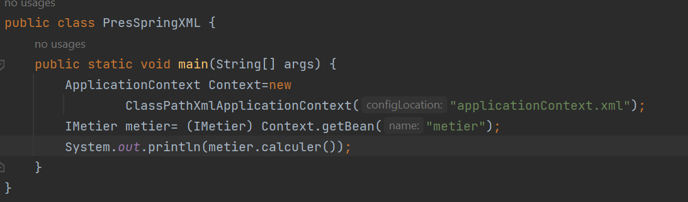
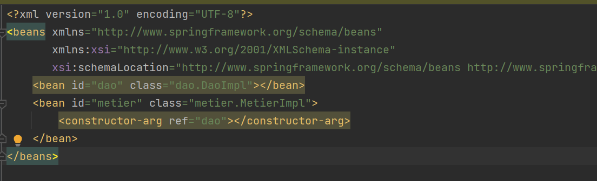
<h1> Part 2 : </h1>
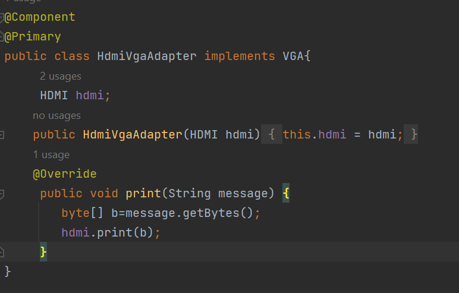
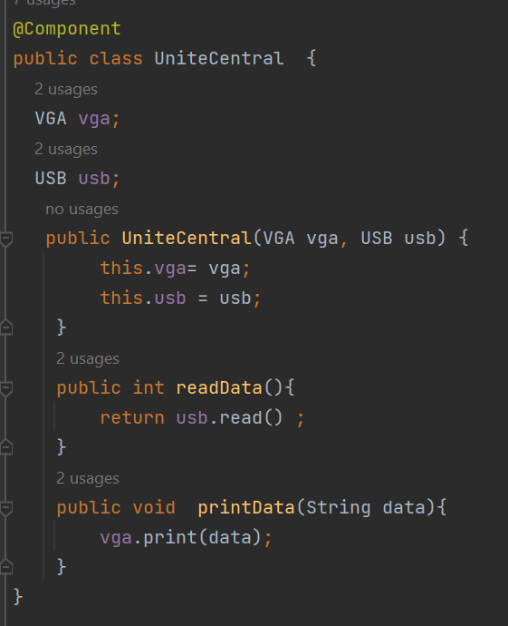
<h3> Version annotation spring </h3>
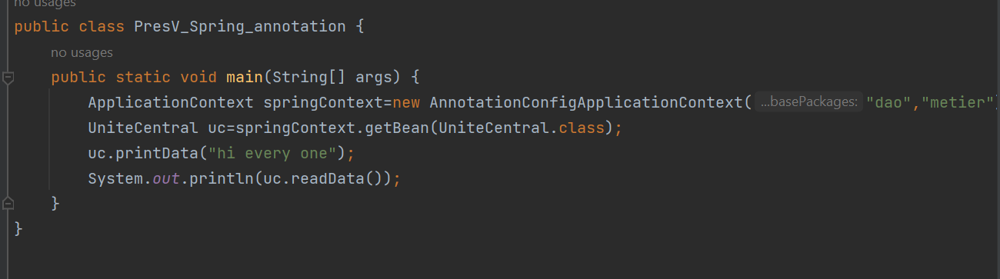
<h3> Version XML spring </h3>
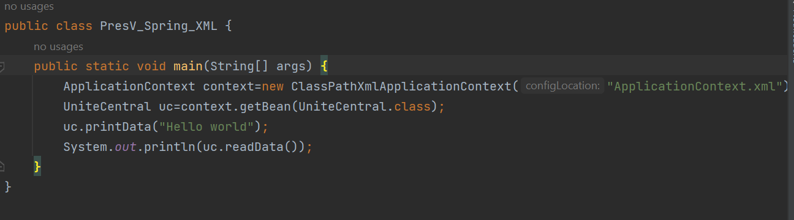
<h3> fichier XML </h3>
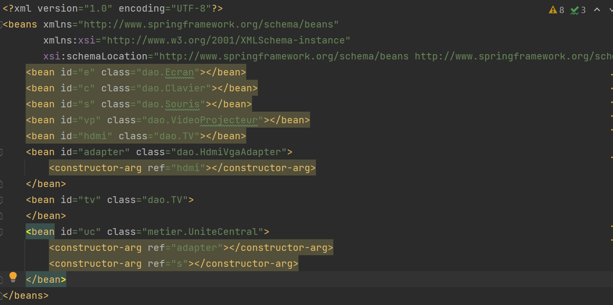
<h3> Resultat </h3>
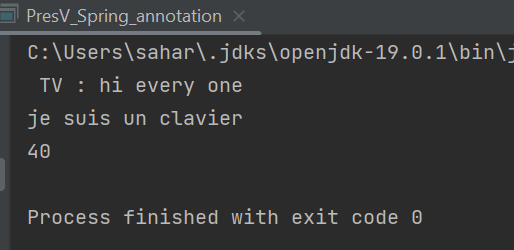

